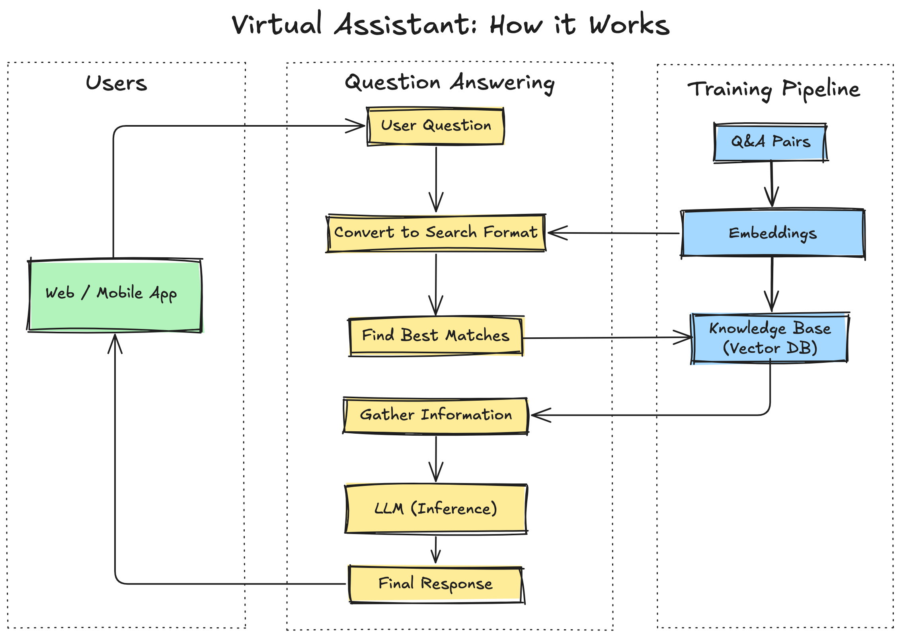

# Simple Q/A  AI Assistant

This project creates an AI-powered assistant using Ollama and Chroma.

## Architecture Overview

The RAG pipeline uses:

- ChromaDB for vector storage
- Ollama for model serving
- Ollama embeddings for retrieval (mxbai-embed-large)



## Features

1. **Natural Language Understanding**
   - Users can ask questions in their own words
   - Handles variations in how questions are asked

2. **Consistency and Accuracy**
   - Pulls from trained data sources
   - Standardized responses for specific questions

## Prerequisites

- Python 3.11 or higher
- Ollama installed ([Ollama Installation Guide](https://github.com/ollama/ollama))
- 16GB RAM minimum

## Installation

1. Clone the repository:
```bash
git clone https://github.com/schmitech/simple-qa-chatbot.git
cd simple-qa-chatbot
```

2. Install required packages:
```bash
pip install langchain-core
pip install langchain-community
pip install langchain-ollama
```

3. Create and activate a virtual environment:
```bash
python -m venv venv
source venv/bin/activate  # On Windows: venv\Scripts\activate
```

4. Install required packages:
```bash
pip install -r requirements.txt
```

1. Create a `.env` file for ingestion scripts (copy from .env.example):
```env
CHROMA_PERSIST_DIRECTORY="./chroma_db"
OLLAMA_BASE_URL="http://localhost:11434"
OLLAMA_TEMPERATURE=0.7
OLLAMA_MODEL="qa-chatbot"
CHROMA_COLLECTION="qa-chatbot"
```

## Deploy Ollama Model

```bash
./deploy-model.sh
```

## Data Ingestion

1. Ingest data into Pinecone (requires .env configuration):
```bash
python chroma-data-ingestion.py qa_pairs.json
```

2. Start the ChromaDB server:
```bash
chroma run --host localhost --port 8000 --path ./chroma_db
```

3. Test Query
```bash
python query_chroma.py "How much is the property tax for a house?"
```

## Running the Streamlit Chat Interface:

1. Start a conversation:
```bash
streamlit run chatbot_app_chroma.py
```

## Running the React/Vite Interface:

```bash
cd rag-chatbot-chroma-ollama
npm install
npm run server -- ollama # or hf (huggingface)
npm run dev
```

## Configuration

1. Adjust  `.streamlit/secrets.toml` to your needs:
```toml
PAGE_TITLE = "Q/A Assistant"
OLLAMA_BASE_URL = "http://localhost:11434"
OLLAMA_TEMPERATURE = 0.1
OLLAMA_MODEL = "qa-chatbot"
CHROMA_PERSIST_DIRECTORY = "./chroma_db"
CHROMA_COLLECTION = "qa-chatbot"
ELEVEN_LABS_API_KEY = "your-elevenlabs-api-key" # Only needed for text-to-speech support
ELEVEN_LABS_VOICE_ID = "your-elevenlabs-voice-id" # Only needed for text-to-speech support
```

## Key Components
- `chroma-data-ingestion.py`: Handles vector embedding and storage
- `chatbot_app_chroma.py`: Web interface for seamless interactions
- `qa_pairs.json`: Sample dataset of Q/A pairs

## Limitations

- Limited to trained topics
- Response time varies based on hardware

## Troubleshooting

Common issues and solutions:

1. ChromaDB connection issues:
   - Verify ChromaDB server is running (`chroma run --host localhost --port 8000`)
   - Check CHROMA_PERSIST_DIRECTORY exists and has correct permissions
   - Ensure collection name matches CHROMA_COLLECTION in .env
   - Validate data ingestion completed successfully

2. Ollama integration:
   - Confirm Ollama is running (`curl http://localhost:11434/api/tags`)
   - Verify OLLAMA_BASE_URL is accessible
   - Check if model is properly downloaded (`ollama list`)
   - Monitor system resources (RAM/CPU) during model loading

3. Data ingestion problems:
   - Validate JSON format in qa_pairs.json
   - Check Python environment has all requirements installed
   - Ensure sufficient disk space for vector storage
   - Monitor ChromaDB logs for embedding errors

4. Performance issues:
   - Consider reducing OLLAMA_TEMPERATURE for more focused responses
   - Verify system meets minimum RAM requirements (16GB)
   - Check for competing resource-intensive processes
   - Monitor ChromaDB query latency

5. Environment setup:
   - Confirm Python version is 3.11 or higher
   - Verify all environment variables are properly set
   - Check virtual environment is activated
   - Validate all dependencies in requirements.txt are installed

## License

This project is licensed under the Apache 2.0 License - see the LICENSE file for details.

## Acknowledgments

- [Ollama](https://github.com/ollama/ollama) for the model serving infrastructure
- Mistral AI for the base model

## Support

For support, please open an issue in the GitHub repository.